<div align="center">

# 🎨 Character Design Template

**Version 1.0.0** &nbsp;·&nbsp; Image Generation &nbsp;·&nbsp; Advanced

*A structured prompt framework for creating highly detailed, story-driven, and visually compelling character designs.*

[](#model-notes)
[](#license)
[](https://github.com/sharjeelx03)

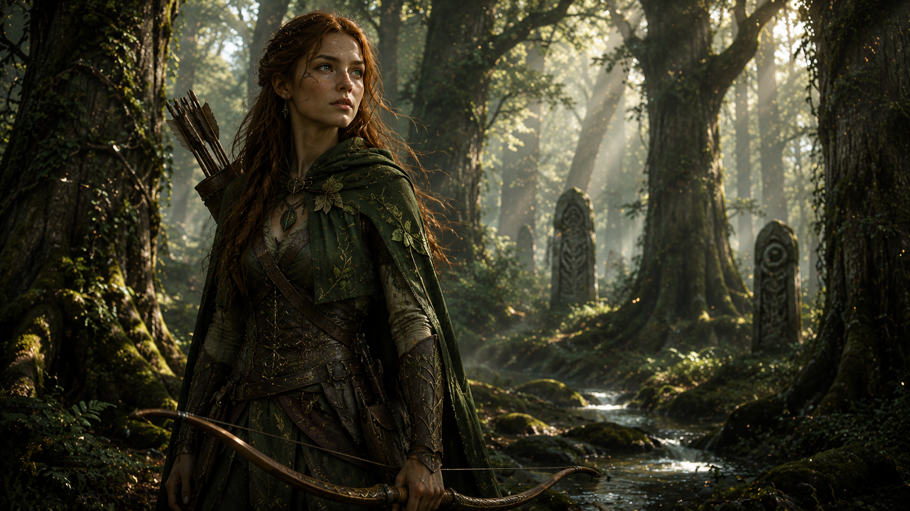

</div>

---

## 📋 Overview

| Field | Details |
|---|---|
| **Category** | Image Generation |
| **Difficulty** | Advanced |
| **Models Tested** | Midjourney, Flux, SDXL, DALL·E, Ideogram |
| **Author** | [shareelx03](https://github.com/sharjeelx03) |

This template helps generate consistent, professional-quality characters across multiple **genres**, **environments**, and **artistic styles** — from gritty realism to epic fantasy and hard sci-fi.

---

## 📖 Table of Contents

1. [The Prompt Template](#the-prompt-template)
2. [Character Examples](#character-examples)
   - [Village Farmer](#-village-farmer)
   - [Cyberpunk Assassin](#-cyberpunk-assassin)
   - [Mars Explorer](#-mars-explorer)
   - [Moon Guardian](#-moon-guardian)
   - [Mud Arena Warrior](#-mud-arena-warrior)
   - [Deep Sea Diver](#-deep-sea-diver)
   - [Arctic Survivalist](#-arctic-survivalist)
   - [Jungle Hunter](#-jungle-hunter)
   - [Volcano Blacksmith](#-volcano-blacksmith)
   - [Space Station Engineer](#-space-station-engineer)
   - [Desert Nomad](#-desert-nomad)
   - [Medieval King](#-medieval-king)
   - [Forest Ranger](#-forest-ranger)
   - [Mech Pilot](#-mech-pilot)
   - [Whiskers & Nibbles](#-whiskers--nibbles)
3. [Tips for Best Results](#-tips-for-best-results)
4. [Style Variations](#-style-variations)
5. [Model Notes](#-model-notes)
6. [Contribution Checklist](#-contribution-checklist)
7. [License](#-license)

---

## 🧩 The Prompt Template

```text
Create a highly detailed, original character design with strong visual storytelling and professional concept-art quality.

## Character Identity

- Character Name: [CHARACTER_NAME]
- Character Type: [CHARACTER_TYPE]
- Gender: [GENDER]
- Age Range: [AGE_RANGE]
- Species / Race: [SPECIES_OR_RACE]
- Occupation / Role: [ROLE_OR_PROFESSION]

---

## Personality & Story

- Personality Traits: [PERSONALITY_TRAITS]
- Character Archetype: [ARCHETYPE]
- Backstory Theme: [BACKSTORY_THEME]
- Emotional State: [CURRENT_EMOTION]

---

## Appearance

- Body Type: [BODY_TYPE]
- Facial Features: [FACIAL_FEATURES]
- Eye Description: [EYE_DETAILS]
- Hairstyle: [HAIRSTYLE]
- Skin / Fur / Material Details: [SURFACE_DETAILS]
- Distinctive Features: [UNIQUE_FEATURES]

---

## Clothing & Equipment

- Outfit / Armor: [OUTFIT_OR_ARMOR]
- Accessories: [ACCESSORIES]
- Weapons / Tools: [WEAPONS_OR_TOOLS]
- Technology Level: [TECH_LEVEL]

---

## Pose & Action

- Pose: [POSE]
- Action: [ACTION]
- Expression: [EXPRESSION]

---

## Environment

- Environment / Location: [ENVIRONMENT]
- Time of Day: [TIME_OF_DAY]
- Weather / Atmosphere: [ATMOSPHERE]

---

## Visual Direction

- Art Style: [VISUAL_STYLE]
- Color Palette: [COLOR_PALETTE]
- Lighting Style: [LIGHTING]
- Composition: [COMPOSITION]
- Camera Angle: [CAMERA_ANGLE]
- Lens Type: [LENS_TYPE]

---

## Quality Settings

- Detail Level: [DETAIL_LEVEL]
- Render Quality: [RENDER_QUALITY]
- Aspect Ratio: [ASPECT_RATIO]

---

## Final Prompt

[CHARACTER_NAME], a [AGE_RANGE] [SPECIES_OR_RACE] [ROLE_OR_PROFESSION], embodying [PERSONALITY_TRAITS], featuring [FACIAL_FEATURES], [EYE_DETAILS], and [UNIQUE_FEATURES]. Wearing [OUTFIT_OR_ARMOR] with [ACCESSORIES] and carrying [WEAPONS_OR_TOOLS]. Captured in a [POSE] while [ACTION], displaying a [EXPRESSION] expression.

Set within [ENVIRONMENT] during [TIME_OF_DAY], surrounded by [ATMOSPHERE]. Visual storytelling emphasizes [BACKSTORY_THEME]. Cinematic composition using [COMPOSITION], photographed from a [CAMERA_ANGLE] with a [LENS_TYPE].

Art style: [VISUAL_STYLE]. Color palette dominated by [COLOR_PALETTE]. Lighting defined by [LIGHTING]. Highly detailed materials, realistic textures, professional concept-art quality, strong silhouette, visually iconic design, [DETAIL_LEVEL], [RENDER_QUALITY], aspect ratio [ASPECT_RATIO].

Negative Prompt:
blurry, low quality, bad anatomy, extra limbs, duplicate body parts, distorted face, watermark, text, logo, cropped subject, poorly drawn hands, low detail, oversaturated colors, unrealistic proportions
```

---

## 🗂 Character Examples

> Each example includes a complete template input, a generated output prompt, and a final rendered image.  
> Characters span diverse environments, visual styles, and archetypes.

---

### 🌾 Village Farmer

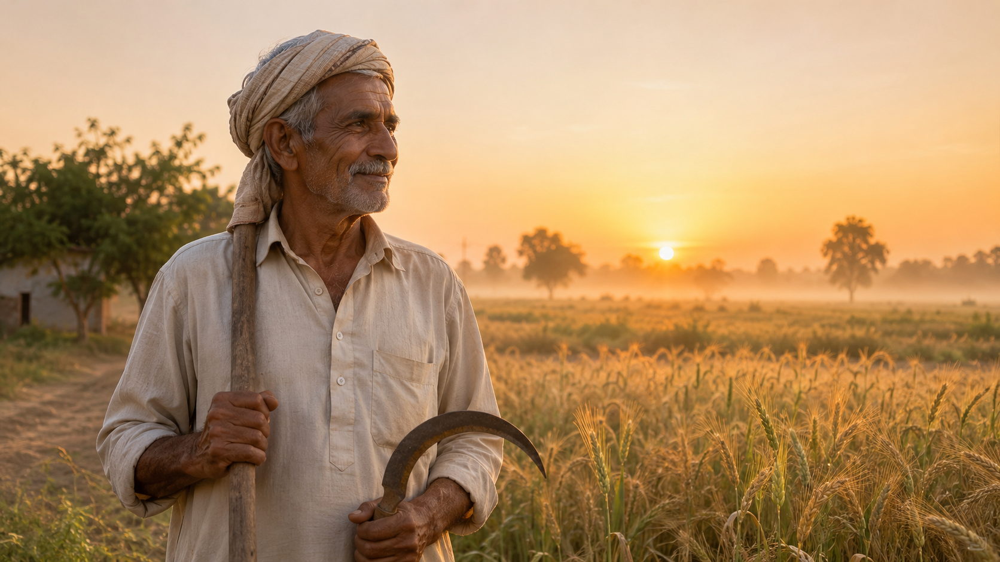

<details>
<summary><strong>▶ Input Parameters</strong></summary>

```text
CHARACTER_NAME: Abdul Rahman
CHARACTER_TYPE: Village Farmer
GENDER: Male
AGE_RANGE: 55-65
SPECIES_OR_RACE: Human
ROLE_OR_PROFESSION: Wheat Farmer

PERSONALITY_TRAITS: hardworking, humble, wise, patient
ARCHETYPE: mentor
BACKSTORY_THEME: generations of farming tradition
CURRENT_EMOTION: contentment

BODY_TYPE: lean and weathered
FACIAL_FEATURES: sun-tanned skin, wrinkles, kind eyes
EYE_DETAILS: warm brown eyes
HAIRSTYLE: short gray hair
SURFACE_DETAILS: weathered skin from years of outdoor work
UNIQUE_FEATURES: traditional village turban

OUTFIT_OR_ARMOR: cotton shalwar kameez
ACCESSORIES: wooden farming tools
WEAPONS_OR_TOOLS: farming sickle
TECH_LEVEL: traditional

POSE: standing proudly
ACTION: looking across his wheat fields
EXPRESSION: gentle smile

ENVIRONMENT: rural farmland
TIME_OF_DAY: sunrise
ATMOSPHERE: morning mist

VISUAL_STYLE: cinematic realism
COLOR_PALETTE: golden yellow, earthy brown, green
LIGHTING: warm sunrise lighting
COMPOSITION: rule of thirds
CAMERA_ANGLE: eye level
LENS_TYPE: 50mm

DETAIL_LEVEL: ultra detailed
RENDER_QUALITY: National Geographic photography
ASPECT_RATIO: 16:9
```

</details>

**Generated Output:**

```text
Abdul Rahman, elderly wheat farmer standing proudly among endless golden wheat fields during sunrise, weathered face, kind brown eyes, traditional village turban, cotton shalwar kameez moving in the morning breeze, holding a farming sickle, warm sunlight illuminating the farmland, atmospheric morning mist, cinematic realism, National Geographic photography quality, ultra-detailed textures, realistic skin and fabric details, eye-level composition, 50mm lens, peaceful rural atmosphere
```

---

### 🌆 Cyberpunk Assassin


<details>
<summary><strong>▶ Input Parameters</strong></summary>

```text
CHARACTER_NAME: Nyx
CHARACTER_TYPE: Cybernetic Assassin
GENDER: Female
AGE_RANGE: 25-30
SPECIES_OR_RACE: Enhanced Human
ROLE_OR_PROFESSION: Contract Killer

PERSONALITY_TRAITS: cold, intelligent, efficient
ARCHETYPE: shadow operative
BACKSTORY_THEME: survival in a corporate dystopia
CURRENT_EMOTION: focused

BODY_TYPE: athletic
FACIAL_FEATURES: sharp cheekbones, cybernetic implants
EYE_DETAILS: glowing blue cybernetic eyes
HAIRSTYLE: short black undercut
SURFACE_DETAILS: synthetic skin enhancements
UNIQUE_FEATURES: neural implant patterns

OUTFIT_OR_ARMOR: black nano-fiber stealth suit
ACCESSORIES: energy daggers
WEAPONS_OR_TOOLS: plasma blade
TECH_LEVEL: advanced futuristic

POSE: standing on rooftop edge
ACTION: scanning the city below
EXPRESSION: emotionless determination

ENVIRONMENT: cyberpunk megacity
TIME_OF_DAY: midnight
ATMOSPHERE: rain and neon fog

VISUAL_STYLE: cyberpunk realism
COLOR_PALETTE: neon blue, purple, black
LIGHTING: neon city lighting
COMPOSITION: hero composition
CAMERA_ANGLE: low-angle shot
LENS_TYPE: 85mm

DETAIL_LEVEL: ultra detailed
RENDER_QUALITY: AAA game concept art
ASPECT_RATIO: 16:9
```

</details>

**Generated Output:**

```text
Nyx, elite cybernetic assassin standing atop a skyscraper overlooking a neon megacity, black nano-fiber stealth suit with glowing cybernetic implants, blue cybernetic eyes reflecting city lights, energy daggers attached to her armor, heavy rain falling through neon fog, low-angle hero composition, cyberpunk realism, ultra-detailed armor textures, purple and blue lighting, AAA game concept art quality, cinematic atmosphere, 85mm lens
```

---

### 🪐 Mars Explorer


<details>
<summary><strong>▶ Input Parameters</strong></summary>

```text
CHARACTER_NAME: Commander Atlas
CHARACTER_TYPE: Planetary Explorer
GENDER: Male
AGE_RANGE: 35-40
SPECIES_OR_RACE: Human
ROLE_OR_PROFESSION: Scientist

PERSONALITY_TRAITS: brave, curious, intelligent
ARCHETYPE: explorer
BACKSTORY_THEME: humanity's expansion into space
CURRENT_EMOTION: determined

BODY_TYPE: athletic
FACIAL_FEATURES: strong jawline
EYE_DETAILS: focused brown eyes
HAIRSTYLE: hidden by helmet
SURFACE_DETAILS: dust-covered EVA suit
UNIQUE_FEATURES: mission commander insignia

OUTFIT_OR_ARMOR: advanced Mars exploration suit
ACCESSORIES: holographic scanner
WEAPONS_OR_TOOLS: scientific equipment
TECH_LEVEL: near-future

POSE: kneeling beside rock formation
ACTION: collecting geological samples
EXPRESSION: focused concentration

ENVIRONMENT: Martian canyon
TIME_OF_DAY: afternoon
ATMOSPHERE: red dust storm

VISUAL_STYLE: NASA realism
COLOR_PALETTE: red, orange, silver
LIGHTING: harsh sunlight
COMPOSITION: cinematic wide shot
CAMERA_ANGLE: slight low angle
LENS_TYPE: 24mm

DETAIL_LEVEL: ultra detailed
RENDER_QUALITY: space documentary quality
ASPECT_RATIO: 21:9
```

</details>

**Generated Output:**

```text
Commander Atlas exploring a vast Martian canyon during a red dust storm, advanced EVA exploration suit covered in Martian dust, holographic scanner projecting scientific data, collecting geological samples, dramatic planetary landscape stretching to the horizon, NASA-inspired realism, harsh sunlight, red-orange environment, ultra-detailed science fiction photography, cinematic scale, 24mm lens, realistic space exploration atmosphere
```

---

### 🌙 Moon Guardian

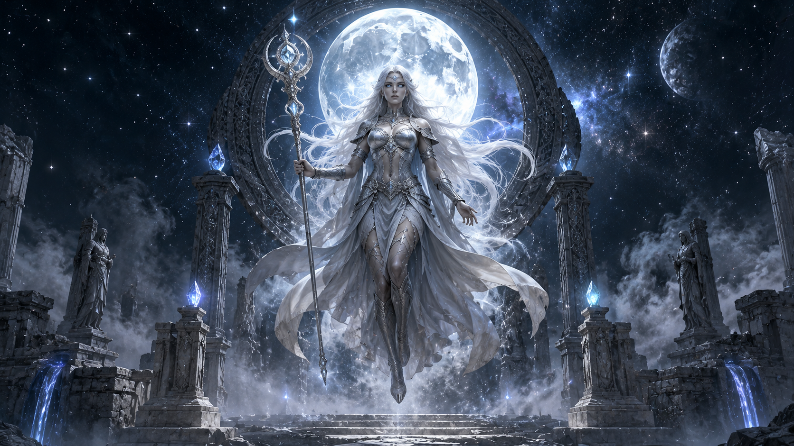

<details>
<summary><strong>▶ Input Parameters</strong></summary>

```text
CHARACTER_NAME: Selene
CHARACTER_TYPE: Lunar Guardian
GENDER: Female
AGE_RANGE: Timeless
SPECIES_OR_RACE: Celestial Being
ROLE_OR_PROFESSION: Temple Protector

PERSONALITY_TRAITS: elegant, mysterious, powerful
ARCHETYPE: guardian
BACKSTORY_THEME: protector of forgotten civilizations
CURRENT_EMOTION: calm vigilance

BODY_TYPE: graceful
FACIAL_FEATURES: ethereal beauty
EYE_DETAILS: glowing silver eyes
HAIRSTYLE: flowing white hair
SURFACE_DETAILS: luminous skin
UNIQUE_FEATURES: celestial markings

OUTFIT_OR_ARMOR: silver ceremonial armor
ACCESSORIES: crystal staff
WEAPONS_OR_TOOLS: lunar energy staff
TECH_LEVEL: mystical

POSE: floating above temple ruins
ACTION: guarding sacred structures
EXPRESSION: serene confidence

ENVIRONMENT: ancient moon sanctuary
TIME_OF_DAY: eternal lunar night
ATMOSPHERE: cosmic mist

VISUAL_STYLE: epic fantasy realism
COLOR_PALETTE: silver, white, blue
LIGHTING: moonlight
COMPOSITION: symmetrical composition
CAMERA_ANGLE: upward dramatic shot
LENS_TYPE: 35mm

DETAIL_LEVEL: ultra detailed
RENDER_QUALITY: film concept art
ASPECT_RATIO: 16:9
```

</details>

**Generated Output:**

```text
Selene, celestial lunar guardian floating above ancient moon temple ruins, silver ceremonial armor glowing beneath soft moonlight, crystal staff radiating cosmic energy, luminous skin and flowing white hair, cosmic mist surrounding sacred structures, epic fantasy realism, silver and blue palette, cinematic composition, ultra-detailed textures, mythological atmosphere, 35mm lens
```

---

### ⚔️ Mud Arena Warrior

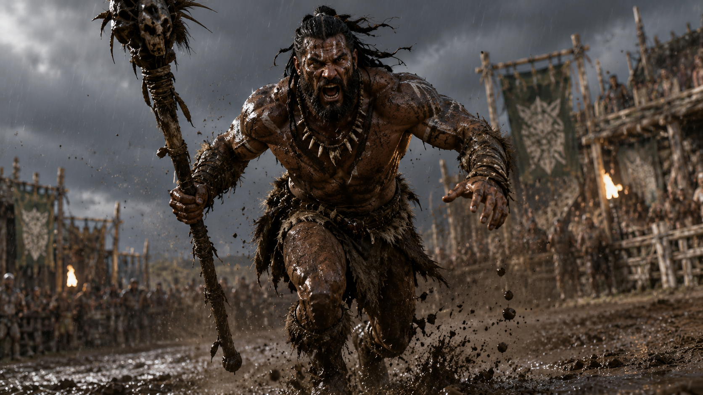

<details>
<summary><strong>▶ Input Parameters</strong></summary>

```text
CHARACTER_NAME: Gorr
CHARACTER_TYPE: Tribal Champion
GENDER: Male
AGE_RANGE: 28-35
SPECIES_OR_RACE: Human
ROLE_OR_PROFESSION: Tribal Athlete

PERSONALITY_TRAITS: determined, resilient, fearless
ARCHETYPE: legendary warrior
BACKSTORY_THEME: overcoming extreme challenges
CURRENT_EMOTION: intense focus

BODY_TYPE: massively muscular
FACIAL_FEATURES: weathered face, strong jawline, thick beard
EYE_DETAILS: intense dark eyes
HAIRSTYLE: long braided hair
SURFACE_DETAILS: mud-covered skin, rugged features
UNIQUE_FEATURES: traditional tribal markings

OUTFIT_OR_ARMOR: animal-hide attire covered in mud
ACCESSORIES: bone necklace
WEAPONS_OR_TOOLS: ceremonial tribal staff
TECH_LEVEL: primitive tribal

POSE: running forward with confidence
ACTION: moving powerfully across muddy terrain
EXPRESSION: determined shout

ENVIRONMENT: mud arena after heavy rain
TIME_OF_DAY: stormy afternoon
ATMOSPHERE: flying mud and rain

VISUAL_STYLE: raw cinematic realism
COLOR_PALETTE: brown, dark gray, muted green
LIGHTING: dramatic storm lighting
COMPOSITION: dynamic action composition
CAMERA_ANGLE: low-angle action shot
LENS_TYPE: 28mm cinematic lens

DETAIL_LEVEL: ultra detailed
RENDER_QUALITY: AAA game concept art
ASPECT_RATIO: 16:9
```

</details>

**Generated Output:**

```text
Gorr, a massively muscular tribal gladiator arena fighter embodying aggression, resilience, and fearlessness. Scarred face, broken nose, thick beard, intense dark eyes, long braided hair, mud-covered skin marked with battle scars and tribal war paint. Wearing animal-hide armor covered in mud, bone necklace, wielding a massive stone axe. Charging forward through a muddy battlefield while swinging his weapon, ferocious battle scream, powerful action pose.

Set inside a mud arena after heavy rain during a stormy afternoon, flying mud, heavy rainfall, thunderclouds overhead. Raw cinematic realism, dramatic storm lighting, brown and dark gray color palette, low-angle action composition emphasizing power and momentum. Ultra-detailed textures, realistic mud splashes, cinematic motion blur, AAA game concept art quality, 28mm cinematic lens, epic battlefield atmosphere.
```

---

### 🌊 Deep Sea Diver

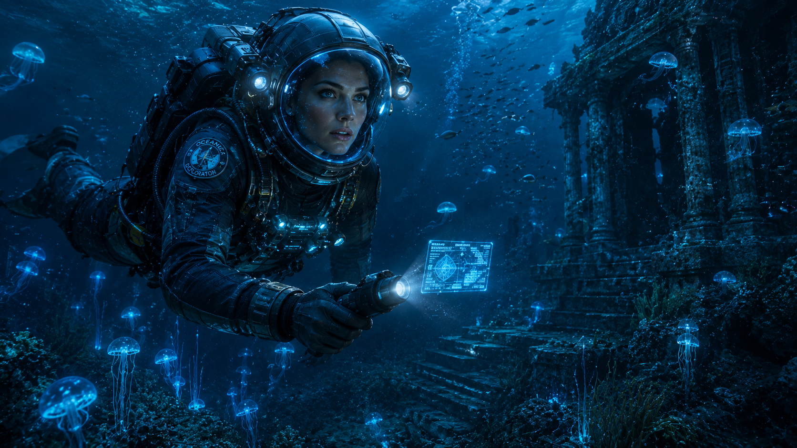

<details>
<summary><strong>▶ Input Parameters</strong></summary>

```text
CHARACTER_NAME: Marina
CHARACTER_TYPE: Deep Sea Explorer
GENDER: Female
AGE_RANGE: 30-40
SPECIES_OR_RACE: Human
ROLE_OR_PROFESSION: Marine Biologist

PERSONALITY_TRAITS: curious, fearless, intelligent
ARCHETYPE: explorer
BACKSTORY_THEME: discovering unknown life beneath the ocean
CURRENT_EMOTION: wonder

BODY_TYPE: athletic
FACIAL_FEATURES: sharp features, determined expression
EYE_DETAILS: bright blue eyes
HAIRSTYLE: hidden beneath diving helmet
SURFACE_DETAILS: water droplets, reflective diving suit
UNIQUE_FEATURES: custom deep-ocean research insignia

OUTFIT_OR_ARMOR: advanced deep-sea exploration suit
ACCESSORIES: underwater scanner
WEAPONS_OR_TOOLS: research equipment
TECH_LEVEL: advanced

POSE: swimming forward
ACTION: exploring ancient underwater ruins
EXPRESSION: awe and curiosity

ENVIRONMENT: abyssal ocean trench
TIME_OF_DAY: deep ocean darkness
ATMOSPHERE: bioluminescent marine life

VISUAL_STYLE: underwater realism
COLOR_PALETTE: deep blue, cyan, teal
LIGHTING: bioluminescent glow
COMPOSITION: cinematic underwater composition
CAMERA_ANGLE: wide underwater shot
LENS_TYPE: 35mm

DETAIL_LEVEL: ultra detailed
RENDER_QUALITY: documentary photography
ASPECT_RATIO: 16:9
```

</details>

**Generated Output:**

```text
Marina, fearless deep-sea explorer swimming through an ancient submerged civilization deep within an abyssal trench, advanced diving suit illuminated by glowing bioluminescent marine life, underwater scanner actively mapping the ruins, mysterious ocean darkness surrounding colossal structures, cinematic underwater realism, volumetric light rays, ultra-detailed water effects, documentary-quality photography, 35mm lens, breathtaking deep-ocean atmosphere
```

---

### ❄️ Arctic Survivalist

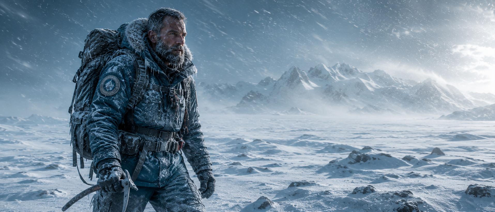

<details>
<summary><strong>▶ Input Parameters</strong></summary>

```text
CHARACTER_NAME: Frost
CHARACTER_TYPE: Arctic Survival Expert
GENDER: Male
AGE_RANGE: 40-50
SPECIES_OR_RACE: Human
ROLE_OR_PROFESSION: Explorer

PERSONALITY_TRAITS: disciplined, resilient, resourceful
ARCHETYPE: survivor
BACKSTORY_THEME: enduring the harshest climates on Earth
CURRENT_EMOTION: determination

BODY_TYPE: rugged
FACIAL_FEATURES: frost-covered beard, weathered face
EYE_DETAILS: piercing blue eyes
HAIRSTYLE: short gray hair
SURFACE_DETAILS: frozen clothing, ice-covered gear
UNIQUE_FEATURES: polar expedition insignia

OUTFIT_OR_ARMOR: heavy arctic survival gear
ACCESSORIES: ice axe
WEAPONS_OR_TOOLS: survival backpack
TECH_LEVEL: modern

POSE: walking against strong winds
ACTION: crossing a frozen wasteland
EXPRESSION: focused determination

ENVIRONMENT: arctic tundra
TIME_OF_DAY: early morning
ATMOSPHERE: blizzard

VISUAL_STYLE: survival realism
COLOR_PALETTE: white, blue, gray
LIGHTING: cold daylight
COMPOSITION: wide environmental shot
CAMERA_ANGLE: eye level
LENS_TYPE: 50mm

DETAIL_LEVEL: ultra detailed
RENDER_QUALITY: National Geographic photography
ASPECT_RATIO: 21:9
```

</details>

**Generated Output:**

```text
Frost, hardened arctic explorer crossing a frozen wasteland during a violent blizzard, frost-covered beard, rugged survival equipment, ice axe firmly in hand, endless snow-covered landscape stretching into the horizon, survival realism, cold blue and white palette, dramatic environmental storytelling, National Geographic photography quality, ultra-detailed snow textures, 50mm lens
```

---

### 🌿 Jungle Hunter

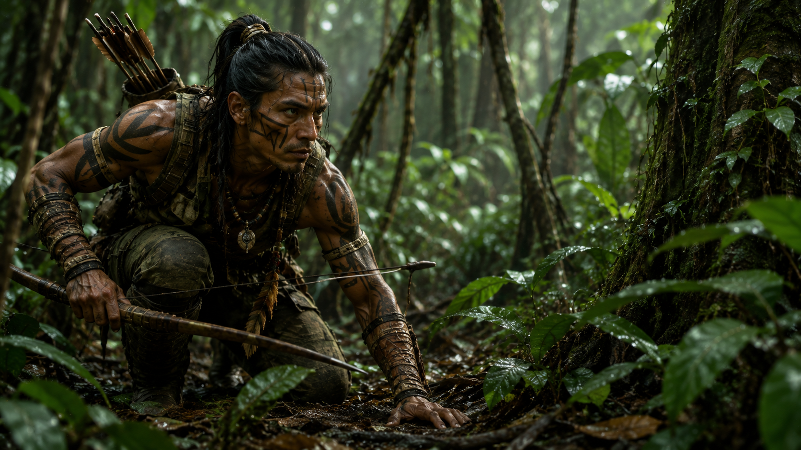

<details>
<summary><strong>▶ Input Parameters</strong></summary>

```text
CHARACTER_NAME: Koda
CHARACTER_TYPE: Jungle Tracker
GENDER: Male
AGE_RANGE: 25-35
SPECIES_OR_RACE: Human
ROLE_OR_PROFESSION: Hunter

PERSONALITY_TRAITS: observant, agile, instinctive
ARCHETYPE: hunter
BACKSTORY_THEME: master of rainforest survival
CURRENT_EMOTION: focused

BODY_TYPE: athletic
FACIAL_FEATURES: sharp jawline, tribal markings
EYE_DETAILS: dark observant eyes
HAIRSTYLE: long tied-back hair
SURFACE_DETAILS: camouflaged skin paint
UNIQUE_FEATURES: handcrafted tribal accessories

OUTFIT_OR_ARMOR: rainforest camouflage gear
ACCESSORIES: quiver and arrows
WEAPONS_OR_TOOLS: traditional hunting bow
TECH_LEVEL: primitive

POSE: crouched low
ACTION: tracking prey through dense jungle
EXPRESSION: intense concentration

ENVIRONMENT: tropical rainforest
TIME_OF_DAY: afternoon
ATMOSPHERE: humid jungle mist

VISUAL_STYLE: adventure realism
COLOR_PALETTE: green, brown, dark yellow
LIGHTING: sunlight through canopy
COMPOSITION: natural framing
CAMERA_ANGLE: eye level
LENS_TYPE: 50mm

DETAIL_LEVEL: ultra detailed
RENDER_QUALITY: wildlife documentary quality
ASPECT_RATIO: 16:9
```

</details>

**Generated Output:**

```text
Koda, elite rainforest hunter crouched within dense tropical vegetation, handcrafted bow drawn and ready, tribal markings blending into the environment, shafts of sunlight piercing through the jungle canopy, humid mist drifting between ancient trees, adventure realism, ultra-detailed foliage, wildlife documentary photography quality, natural framing, cinematic jungle atmosphere
```

---

### 🔥 Volcano Blacksmith

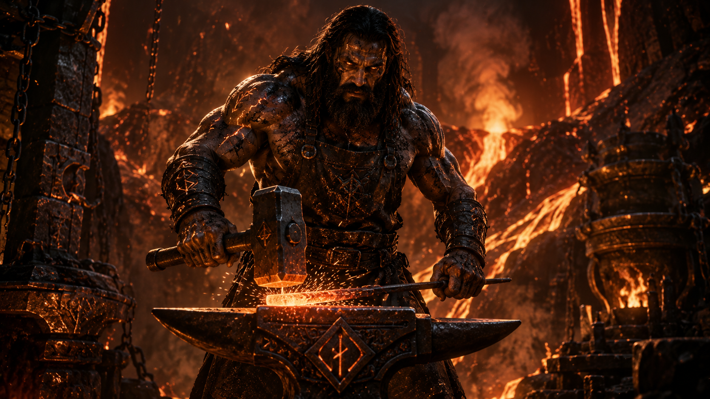

<details>
<summary><strong>▶ Input Parameters</strong></summary>

```text
CHARACTER_NAME: Vulcan
CHARACTER_TYPE: Master Blacksmith
GENDER: Male
AGE_RANGE: 45-55
SPECIES_OR_RACE: Human
ROLE_OR_PROFESSION: Forge Master

PERSONALITY_TRAITS: powerful, disciplined, determined
ARCHETYPE: creator
BACKSTORY_THEME: forging legendary weapons
CURRENT_EMOTION: focused

BODY_TYPE: heavily muscular
FACIAL_FEATURES: burn scars, thick beard
EYE_DETAILS: glowing amber eyes
HAIRSTYLE: long black hair
SURFACE_DETAILS: ash-covered skin
UNIQUE_FEATURES: ancient forge symbols

OUTFIT_OR_ARMOR: heat-resistant leather armor
ACCESSORIES: blacksmith apron
WEAPONS_OR_TOOLS: massive forge hammer
TECH_LEVEL: fantasy medieval

POSE: standing beside anvil
ACTION: forging molten steel
EXPRESSION: intense focus

ENVIRONMENT: volcanic forge
TIME_OF_DAY: night
ATMOSPHERE: lava, sparks, smoke

VISUAL_STYLE: fantasy realism
COLOR_PALETTE: orange, red, black
LIGHTING: lava glow
COMPOSITION: dramatic centered composition
CAMERA_ANGLE: low-angle shot
LENS_TYPE: 35mm

DETAIL_LEVEL: ultra detailed
RENDER_QUALITY: film concept art
ASPECT_RATIO: 16:9
```

</details>

**Generated Output:**

```text
Vulcan, legendary forge master hammering molten steel beside an active volcano, glowing lava illuminating his muscular frame, ash-covered skin, ancient forge symbols carved into armor, sparks erupting through the air, fantasy realism, dramatic orange and black palette, ultra-detailed fire effects, cinematic concept art quality, low-angle composition, 35mm lens
```

---

### 🛰️ Space Station Engineer


<details>
<summary><strong>▶ Input Parameters</strong></summary>

```text
CHARACTER_NAME: Orion
CHARACTER_TYPE: Space Engineer
GENDER: Male
AGE_RANGE: 30-40
SPECIES_OR_RACE: Human
ROLE_OR_PROFESSION: Orbital Systems Engineer

PERSONALITY_TRAITS: intelligent, analytical, innovative
ARCHETYPE: builder
BACKSTORY_THEME: maintaining humanity's future in space
CURRENT_EMOTION: focused

BODY_TYPE: fit
FACIAL_FEATURES: clean-shaven, calm appearance
EYE_DETAILS: focused gray eyes
HAIRSTYLE: short dark hair
SURFACE_DETAILS: high-tech engineering suit
UNIQUE_FEATURES: orbital station insignia

OUTFIT_OR_ARMOR: advanced maintenance suit
ACCESSORIES: holographic tablet
WEAPONS_OR_TOOLS: repair toolkit
TECH_LEVEL: futuristic

POSE: standing near observation window
ACTION: repairing station systems
EXPRESSION: professional concentration

ENVIRONMENT: orbital space station
TIME_OF_DAY: Earth orbit
ATMOSPHERE: advanced technological environment

VISUAL_STYLE: hard science-fiction realism
COLOR_PALETTE: white, blue, silver
LIGHTING: artificial station lighting
COMPOSITION: cinematic engineering scene
CAMERA_ANGLE: three-quarter view
LENS_TYPE: 35mm

DETAIL_LEVEL: ultra detailed
RENDER_QUALITY: AAA sci-fi concept art
ASPECT_RATIO: 21:9
```

</details>

**Generated Output:**

```text
Orion, orbital systems engineer performing critical maintenance aboard a massive space station, advanced engineering suit with holographic diagnostic displays, Earth visible through panoramic observation windows, futuristic repair equipment, hard science-fiction realism, ultra-detailed spacecraft interiors, cinematic lighting, AAA concept art quality, 35mm lens, realistic near-future space exploration atmosphere
```

---

### 🏜️ Desert Nomad

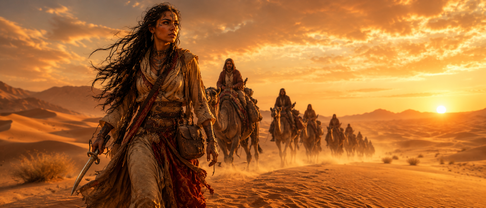

<details>
<summary><strong>▶ Input Parameters</strong></summary>

```text
CHARACTER_NAME: Zahra
CHARACTER_TYPE: Desert Nomad
GENDER: Female
AGE_RANGE: 25-35
SPECIES_OR_RACE: Human
ROLE_OR_PROFESSION: Caravan Guide

PERSONALITY_TRAITS: independent, resilient, adaptable
ARCHETYPE: wanderer
BACKSTORY_THEME: surviving and guiding travelers across endless deserts
CURRENT_EMOTION: determined

BODY_TYPE: athletic
FACIAL_FEATURES: sun-kissed skin, sharp features
EYE_DETAILS: amber eyes
HAIRSTYLE: long dark braided hair
SURFACE_DETAILS: wind-blown clothing, desert dust
UNIQUE_FEATURES: traditional desert tattoos

OUTFIT_OR_ARMOR: flowing desert robes
ACCESSORIES: leather satchel
WEAPONS_OR_TOOLS: ornate curved dagger
TECH_LEVEL: traditional

POSE: walking across dunes
ACTION: leading a caravan through the desert
EXPRESSION: confident determination

ENVIRONMENT: vast desert dunes
TIME_OF_DAY: sunset
ATMOSPHERE: blowing sand and heat haze

VISUAL_STYLE: cinematic adventure realism
COLOR_PALETTE: gold, orange, beige
LIGHTING: golden hour sunlight
COMPOSITION: wide cinematic composition
CAMERA_ANGLE: low-angle travel shot
LENS_TYPE: 50mm

DETAIL_LEVEL: ultra detailed
RENDER_QUALITY: epic adventure film quality
ASPECT_RATIO: 21:9
```

</details>

**Generated Output:**

```text
Zahra, legendary desert nomad guiding a caravan through endless golden dunes during sunset, flowing desert robes moving with the wind, traditional tattoos visible beneath desert dust, ornate curved dagger at her side, blowing sand and shimmering heat haze, cinematic adventure realism, warm gold and orange palette, ultra-detailed desert textures, epic travel photography, 50mm lens, vast atmospheric landscape
```

---

### 👑 Medieval King

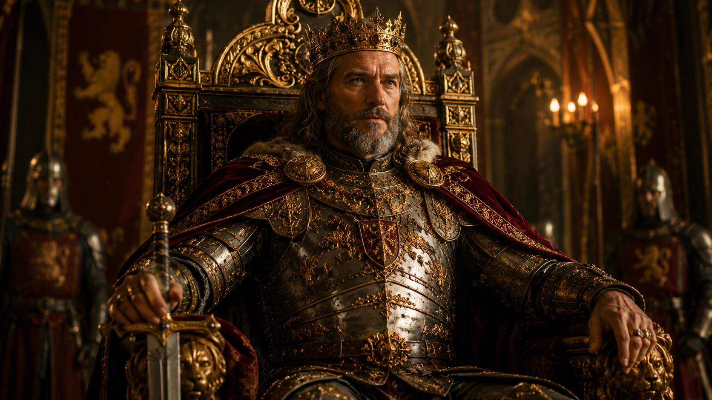

<details>
<summary><strong>▶ Input Parameters</strong></summary>

```text
CHARACTER_NAME: King Aldric
CHARACTER_TYPE: Medieval Monarch
GENDER: Male
AGE_RANGE: 45-55
SPECIES_OR_RACE: Human
ROLE_OR_PROFESSION: King

PERSONALITY_TRAITS: wise, commanding, honorable
ARCHETYPE: ruler
BACKSTORY_THEME: uniting rival kingdoms under one banner
CURRENT_EMOTION: calm authority

BODY_TYPE: broad and imposing
FACIAL_FEATURES: strong jawline, royal beard
EYE_DETAILS: deep blue eyes
HAIRSTYLE: shoulder-length gray hair
SURFACE_DETAILS: weathered skin, regal appearance
UNIQUE_FEATURES: golden crown with gemstones

OUTFIT_OR_ARMOR: ornate royal armor
ACCESSORIES: royal cape
WEAPONS_OR_TOOLS: ceremonial sword
TECH_LEVEL: medieval

POSE: seated upon a throne
ACTION: addressing his kingdom
EXPRESSION: confident wisdom

ENVIRONMENT: grand castle throne room
TIME_OF_DAY: evening
ATMOSPHERE: torch-lit royal hall

VISUAL_STYLE: historical realism
COLOR_PALETTE: gold, crimson, silver
LIGHTING: warm torchlight
COMPOSITION: centered royal composition
CAMERA_ANGLE: slightly low-angle
LENS_TYPE: 85mm

DETAIL_LEVEL: ultra detailed
RENDER_QUALITY: historical epic film quality
ASPECT_RATIO: 16:9
```

</details>

**Generated Output:**

```text
King Aldric seated upon a magnificent throne inside a grand medieval castle hall, ornate royal armor reflecting warm torchlight, golden crown adorned with gemstones, crimson royal cape flowing across stone steps, ceremonial sword resting beside the throne, historical realism, ultra-detailed architecture, cinematic royal atmosphere, epic historical film quality, 85mm lens
```

---

### 🌲 Forest Ranger


<details>
<summary><strong>▶ Input Parameters</strong></summary>

```text
CHARACTER_NAME: Elowen
CHARACTER_TYPE: Forest Ranger
GENDER: Female
AGE_RANGE: 20-30
SPECIES_OR_RACE: Human
ROLE_OR_PROFESSION: Woodland Protector

PERSONALITY_TRAITS: compassionate, vigilant, brave
ARCHETYPE: guardian
BACKSTORY_THEME: protecting ancient forests from destruction
CURRENT_EMOTION: peaceful alertness

BODY_TYPE: athletic and agile
FACIAL_FEATURES: soft features, freckles
EYE_DETAILS: emerald green eyes
HAIRSTYLE: long auburn hair
SURFACE_DETAILS: leaf-patterned clothing
UNIQUE_FEATURES: forest spirit pendant

OUTFIT_OR_ARMOR: light ranger armor
ACCESSORIES: leather quiver
WEAPONS_OR_TOOLS: longbow
TECH_LEVEL: fantasy medieval

POSE: standing among giant trees
ACTION: watching over the forest
EXPRESSION: calm confidence

ENVIRONMENT: ancient enchanted forest
TIME_OF_DAY: early morning
ATMOSPHERE: light mist and glowing particles

VISUAL_STYLE: fantasy realism
COLOR_PALETTE: green, brown, gold
LIGHTING: soft morning sunlight
COMPOSITION: natural framing
CAMERA_ANGLE: eye level
LENS_TYPE: 50mm

DETAIL_LEVEL: ultra detailed
RENDER_QUALITY: fantasy concept art
ASPECT_RATIO: 16:9
```

</details>

**Generated Output:**

```text
Elowen, guardian ranger of an ancient enchanted forest, standing among towering trees covered in moss, emerald eyes watching over the woodland, longbow ready, forest spirit pendant glowing softly, golden morning sunlight filtering through mist and leaves, fantasy realism, lush green palette, ultra-detailed nature textures, cinematic fantasy concept art, 50mm lens
```

---

### 🤖 Mech Pilot

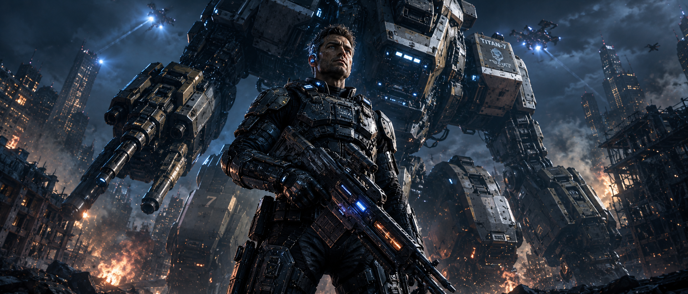

<details>
<summary><strong>▶ Input Parameters</strong></summary>

```text
CHARACTER_NAME: Titan-7
CHARACTER_TYPE: Mech Pilot
GENDER: Male
AGE_RANGE: 30-40
SPECIES_OR_RACE: Human
ROLE_OR_PROFESSION: Combat Pilot

PERSONALITY_TRAITS: fearless, tactical, disciplined
ARCHETYPE: warrior
BACKSTORY_THEME: defending humanity against mechanized threats
CURRENT_EMOTION: battle ready

BODY_TYPE: athletic
FACIAL_FEATURES: battle scars, stern expression
EYE_DETAILS: steel gray eyes
HAIRSTYLE: short military haircut
SURFACE_DETAILS: combat-worn armor
UNIQUE_FEATURES: pilot neural interface

OUTFIT_OR_ARMOR: advanced combat exosuit
ACCESSORIES: tactical equipment
WEAPONS_OR_TOOLS: plasma rifle
TECH_LEVEL: futuristic

POSE: standing before giant mech
ACTION: preparing for deployment
EXPRESSION: focused determination

ENVIRONMENT: war-torn futuristic city
TIME_OF_DAY: night
ATMOSPHERE: smoke, sparks, battlefield debris

VISUAL_STYLE: AAA game concept art
COLOR_PALETTE: blue, gray, orange
LIGHTING: battlefield lighting
COMPOSITION: heroic scale composition
CAMERA_ANGLE: extreme low-angle
LENS_TYPE: 24mm

DETAIL_LEVEL: ultra detailed
RENDER_QUALITY: AAA game cinematic
ASPECT_RATIO: 21:9
```

</details>

**Generated Output:**

```text
Titan-7, elite mech pilot standing before a colossal combat mech in a war-torn futuristic city, advanced exosuit covered in battle damage, neural interface glowing beneath armored helmet, plasma rifle ready for combat, smoke and sparks filling the battlefield, AAA game concept art quality, ultra-detailed machinery, cinematic science fiction realism, epic scale, 24mm lens
```

---

### 🐱 Whiskers & Nibbles

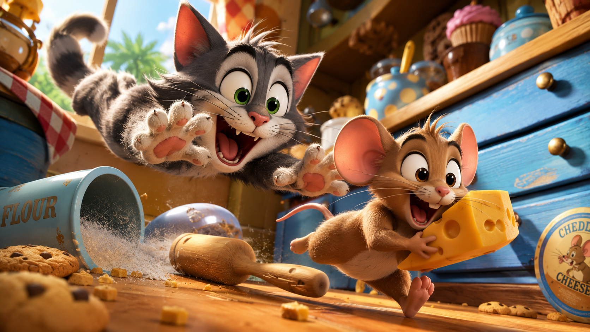

<details>
<summary><strong>▶ Input Parameters</strong></summary>

```text
CHARACTER_NAME: Whiskers & Nibbles
CHARACTER_TYPE: Cartoon Cat and Mouse Duo
GENDER: Male Cat, Male Mouse
AGE_RANGE: Timeless Cartoon Characters
SPECIES_OR_RACE: Cat and Mouse
ROLE_OR_PROFESSION: Mischievous Rivals

PERSONALITY_TRAITS: playful, energetic, competitive
ARCHETYPE: comic duo
BACKSTORY_THEME: endless friendly rivalry
CURRENT_EMOTION: excited

BODY_TYPE: stylized cartoon proportions
FACIAL_FEATURES: large expressive eyes, exaggerated expressions
EYE_DETAILS: bright animated eyes
HAIRSTYLE: cartoon fur styling
SURFACE_DETAILS: soft stylized fur
UNIQUE_FEATURES: oversized cartoon expressions

OUTFIT_OR_ARMOR: none
ACCESSORIES: oversized cheese wedge, wooden spoon
WEAPONS_OR_TOOLS: household objects
TECH_LEVEL: classic cartoon world

POSE: mid-chase action pose
ACTION: mouse sprinting while cat leaps behind
EXPRESSION: surprised and playful

ENVIRONMENT: oversized colorful kitchen
TIME_OF_DAY: daytime
ATMOSPHERE: fun, energetic, family-friendly

VISUAL_STYLE: high-end modern 3D animated feature film
COLOR_PALETTE: warm yellows, bright blues, rich browns
LIGHTING: soft cinematic lighting
COMPOSITION: dynamic action composition
CAMERA_ANGLE: low-angle action shot
LENS_TYPE: 35mm animation camera

DETAIL_LEVEL: ultra detailed
RENDER_QUALITY: feature film quality
ASPECT_RATIO: 16:9
```

</details>

**Generated Output:**

```text
Whiskers and Nibbles, playful cartoon cat chasing a clever mouse through a colorful oversized kitchen, expressive eyes, exaggerated cartoon reactions, mouse sprinting while cat leaps behind, oversized cheese wedge and wooden spoon visible, vibrant family-friendly atmosphere, modern animated feature film quality, cinematic lighting, dynamic action composition, ultra-detailed 3D rendering, 35mm animation camera, polished feature-film visuals
```

---

## 💡 Tips for Best Results

| Tip | Why It Matters |
|---|---|
| Use original characters | Avoids copyright conflicts and keeps designs unique |
| Define environment before visual style | Grounds the visual direction in a real context |
| Use specific personality traits | Drives more expressive, story-rich outputs |
| Include lighting and camera details | Greatly improves cinematic quality |
| Keep color palettes focused | Prevents visual noise and improves cohesion |
| Use realistic material descriptions | Leads to more tactile and believable renders |
| Avoid contradictory styles | Prevents confused, mixed-quality output |
| Add atmosphere for depth | Creates mood and narrative in the final image |

---

## 🎭 Style Variations

This template supports a wide range of genres and character archetypes:

- Fantasy Character Design
- Science Fiction Character Design
- Historical Character Design
- Cartoon & Animated Character Design
- Game Character Design
- Creature & Monster Design
- Superhero Design
- Villain Design
- Mascot Design

---

## 🖥️ Model Notes

**Recommended Models:**

| Model | Best For |
|---|---|
| Midjourney | Artistic quality, stylized renders |
| Flux | Photorealism, detailed textures |
| SDXL | Custom fine-tuned styles |
| DALL·E | Versatile general use |
| Ideogram | Typography-integrated designs |

**Recommended Aspect Ratios:**

| Ratio | Best Use |
|---|---|
| `16:9` | Cinematic scenes, game art |
| `21:9` | Wide concept art, environmental shots |
| `1:1` | Profile portraits, square social posts |

---

## ✅ Contribution Checklist

Before submitting a new character example, verify the following:

- [ ] Prompt is original and not based on copyrighted characters
- [ ] Metadata is complete
- [ ] At least one full example input is included
- [ ] Generated output prompt is included
- [ ] Negative prompt is included
- [ ] Image file is added in `/assets`
- [ ] Image link is working
- [ ] Tested on at least one image generation model

---

## 🏷️ Tags

`character-design` `image-generation` `concept-art` `fantasy` `sci-fi` `cinematic` `prompt-template` `midjourney` `flux` `sdxl`

---

## ⚠️ Originality Notice

All examples feature **original fictional characters**. Do not use copyrighted characters, real celebrities, trademarked universes, or direct style imitations of living artists.

---

## 📄 License

This project is licensed under the **MIT License** — free to use, modify, and distribute with attribution.

---

<div align="center">

Made with ❤️ by [sharjeelx03](https://github.com/sharjeelx03)

</div>
