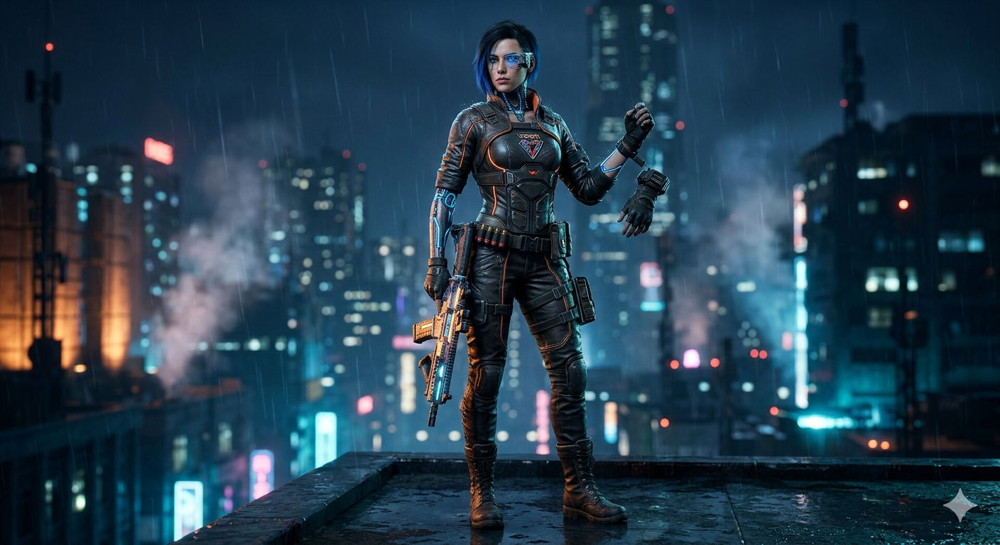
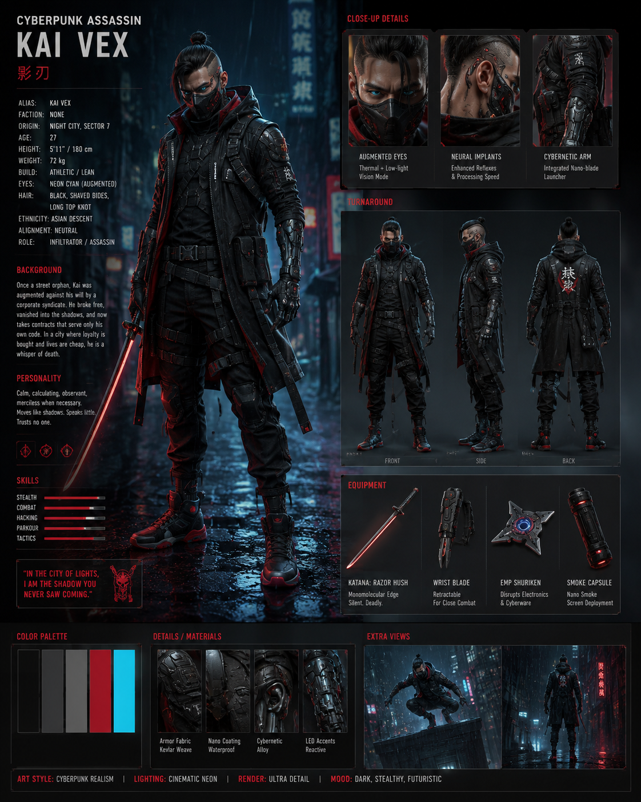

<div align="center">

# 🎨 Character Design Template

**Version 1.0.0** · Image Generation · Advanced

*A structured framework for creating professional, original, and visually compelling character designs.*



</div>

---

# 📋 Overview

This template is designed for creating high-quality original characters for:

* Midjourney
* Flux
* SDXL
* GPT Image
* Ideogram
* Leonardo AI

Suitable for:

* Fantasy Characters
* Sci-Fi Characters
* Historical Characters
* Game Characters
* Original Heroes
* Original Villains
* Mascots
* Creatures

---

# 🧩 Prompt Template

```text
CHARACTER_NAME:

CHARACTER_TYPE:

GENDER:

AGE_RANGE:

SPECIES_OR_RACE:

ROLE_OR_PROFESSION:

PERSONALITY_TRAITS:

ARCHETYPE:

BACKSTORY_THEME:

CURRENT_EMOTION:

BODY_TYPE:

FACIAL_FEATURES:

EYE_DETAILS:

HAIRSTYLE:

SURFACE_DETAILS:

UNIQUE_FEATURES:

OUTFIT_OR_ARMOR:

ACCESSORIES:

WEAPONS_OR_TOOLS:

TECH_LEVEL:

POSE:

ACTION:

EXPRESSION:

ENVIRONMENT:

TIME_OF_DAY:

ATMOSPHERE:

VISUAL_STYLE:

COLOR_PALETTE:

LIGHTING:

COMPOSITION:

CAMERA_ANGLE:

LENS_TYPE:

DETAIL_LEVEL:

RENDER_QUALITY:

ASPECT_RATIO:

OUTPUT:
```

---

# 📝 Field Guide

| Field              | Description                            |
| ------------------ | -------------------------------------- |
| CHARACTER_NAME     | Name of the character                  |
| CHARACTER_TYPE     | Character category                     |
| ROLE_OR_PROFESSION | Occupation or role                     |
| PERSONALITY_TRAITS | Core behavioral traits                 |
| ARCHETYPE          | Hero, mentor, guardian, explorer, etc. |
| BACKSTORY_THEME    | Narrative direction                    |
| OUTFIT_OR_ARMOR    | Clothing or armor                      |
| ACCESSORIES        | Additional visual items                |
| WEAPONS_OR_TOOLS   | Main equipment                         |
| ENVIRONMENT        | Character location                     |
| VISUAL_STYLE       | Overall art style                      |
| COLOR_PALETTE      | Primary colors                         |
| LIGHTING           | Lighting setup                         |
| COMPOSITION        | Image composition                      |
| CAMERA_ANGLE       | Camera perspective                     |

---

# 💡 Best Practices

## Character Design

* Create original characters
* Avoid copyrighted IP
* Focus on strong silhouettes
* Give characters a clear purpose

## Visual Quality

* Define lighting clearly
* Use realistic materials
* Keep color palettes focused
* Use cinematic composition

## Storytelling

* Include a backstory theme
* Define emotion
* Give meaningful equipment
* Match environment to character

---

# 🎭 Recommended Archetypes

* Hero
* Guardian
* Explorer
* Warrior
* Ranger
* Assassin
* Inventor
* Scientist
* Nomad
* Monarch
* Survivor
* Hunter
* Mentor
* Villain
* Anti-Hero

---

# 🖥️ Recommended Models

| Model       | Strength                        |
| ----------- | ------------------------------- |
| Midjourney  | Artistic visuals                |
| Flux        | Realistic rendering             |
| GPT Image   | Consistent character generation |
| SDXL        | Fine-tuned workflows            |
| Ideogram    | Typography support              |
| Leonardo AI | Fast concept creation           |

---

# 📐 Recommended Aspect Ratios

| Ratio | Usage             |
| ----- | ----------------- |
| 1:1   | Portraits         |
| 4:5   | Social media      |
| 16:9  | Cinematic scenes  |
| 21:9  | Concept art       |
| 9:16  | Mobile wallpapers |

---

# ✅ Contribution Checklist

Before submitting:

* [ ] Character is original
* [ ] All fields completed
* [ ] Generated output included
* [ ] Example image added
* [ ] Image stored in assets folder
* [ ] Prompt tested
* [ ] Markdown formatted correctly

---

# 📁 Folder Structure

```text
character-design/
│
├── 00-TEMPLATE.md
├── 01-cyberpunk-assassin.md
├── 02-lunar-guardian.md
├── 03-village-farmer.md
├── 04-mech-pilot.md
├── 05-forest-ranger.md
├── 06-planetary-explorer.md
├── 07-space-engineer.md
├── 08-desert-nomad.md
├── 09-arctic-survivor.md
├── 10-jungle-tracker.md
├── 11-medieval-king.md
├── 12-master-blacksmith.md
├── 13-deep-sea-diver.md
├── 14-dragon-rider.md
├── 15-bounty-hunter.md
│
└── assets/
    └── templ.png
```

---

# 📄 License

MIT License

Free to use, modify, and distribute with attribution.

<div align="center">



</div>
