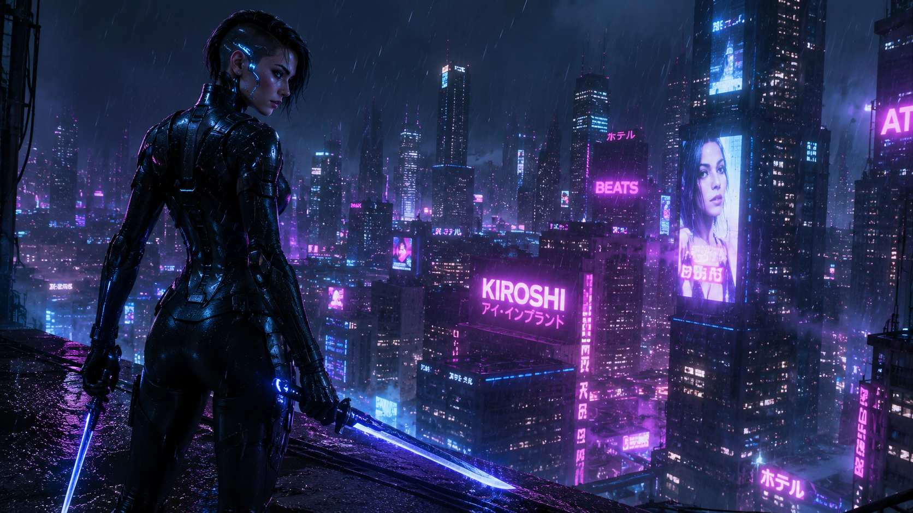

# 🌆 Cyberpunk Assassin



## Overview

A highly trained cybernetic assassin operating in a dystopian megacity controlled by powerful corporations. This example demonstrates advanced sci-fi character design, strong visual storytelling, and cinematic worldbuilding.

---

## Input Parameters

```text
CHARACTER_NAME: Nyx

CHARACTER_TYPE: Cybernetic Assassin

GENDER: Female

AGE_RANGE: 25-30

SPECIES_OR_RACE: Enhanced Human

ROLE_OR_PROFESSION: Contract Assassin

PERSONALITY_TRAITS:
cold, intelligent, precise, disciplined

ARCHETYPE:
shadow operative

BACKSTORY_THEME:
surviving within a corporate dystopia

CURRENT_EMOTION:
focused

BODY_TYPE:
athletic and agile

FACIAL_FEATURES:
sharp cheekbones, angular facial structure

EYE_DETAILS:
glowing blue cybernetic eyes

HAIRSTYLE:
short black undercut hairstyle

SURFACE_DETAILS:
cybernetic implants integrated beneath synthetic skin

UNIQUE_FEATURES:
neural implant circuitry visible around temples

OUTFIT_OR_ARMOR:
black nano-fiber stealth suit with reactive camouflage

ACCESSORIES:
energy daggers, tactical pouches

WEAPONS_OR_TOOLS:
plasma blade

TECH_LEVEL:
advanced futuristic

POSE:
standing on rooftop edge

ACTION:
observing the city below before a mission

EXPRESSION:
emotionless determination

ENVIRONMENT:
cyberpunk megacity

TIME_OF_DAY:
midnight

ATMOSPHERE:
rain, neon reflections, dense urban fog

VISUAL_STYLE:
cyberpunk realism

COLOR_PALETTE:
neon blue, magenta, black

LIGHTING:
neon city lighting

COMPOSITION:
hero composition

CAMERA_ANGLE:
low-angle cinematic shot

LENS_TYPE:
85mm lens

DETAIL_LEVEL:
ultra detailed

RENDER_QUALITY:
AAA game concept art

ASPECT_RATIO:
16:9
```

---

## Generated Output

```text
Nyx, elite cybernetic assassin standing on the edge of a towering skyscraper overlooking a sprawling neon megacity at midnight. Athletic enhanced-human physique, glowing blue cybernetic eyes, visible neural implant circuitry integrated beneath synthetic skin, sharp facial features, short black undercut hairstyle.

Wearing a black nano-fiber stealth suit equipped with reactive camouflage technology, tactical equipment secured across her armor, energy daggers attached to her belt, plasma blade ready for deployment.

Standing motionless while observing the city below before a high-risk mission, expressionless yet intensely focused. Heavy rain falls through glowing neon advertisements, reflecting across wet rooftops and glass skyscrapers.

Cyberpunk realism, cinematic visual storytelling, neon blue and magenta color palette, dramatic volumetric fog, highly detailed futuristic architecture, realistic materials and reflections, low-angle hero composition, 85mm cinematic lens, AAA game concept art quality, ultra-detailed rendering, masterpiece, 8K.
```

---

## Design Notes

### Why This Works

* Strong silhouette
* Distinct visual identity
* Clear role and profession
* Memorable color palette
* Cinematic environment
* Storytelling through pose and atmosphere

### Key Design Elements

* Cybernetic implants
* Neon lighting
* Stealth-oriented armor
* Rooftop setting
* Dystopian city backdrop

### Genre

Science Fiction • Cyberpunk

### Difficulty

Advanced

### Recommended Models

* Midjourney
* Flux
* GPT Image
* SDXL
* Leonardo AI

### Tags

`cyberpunk` `assassin` `sci-fi` `character-design` `concept-art` `image-generation`
