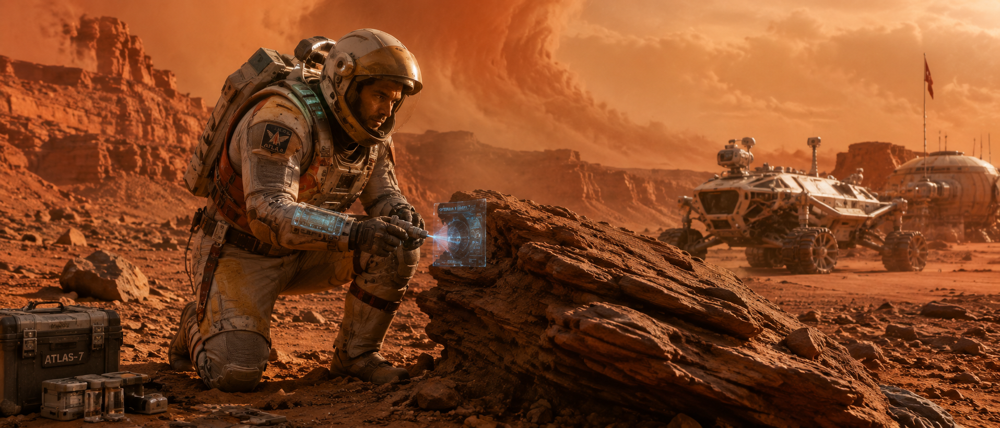

# 🪐 Planetary Explorer



## Overview

A pioneering explorer tasked with charting unknown worlds beyond humanity's frontier. This example demonstrates hard science-fiction design, advanced exploration equipment, and large-scale environmental storytelling.

---

## Input Parameters

```text
CHARACTER_NAME: Commander Atlas

CHARACTER_TYPE: Planetary Explorer

GENDER: Male

AGE_RANGE: 35-45

SPECIES_OR_RACE: Human

ROLE_OR_PROFESSION: Interplanetary Exploration Commander

PERSONALITY_TRAITS:
brave, intelligent, curious, determined

ARCHETYPE:
explorer

BACKSTORY_THEME:
humanity's expansion beyond Earth

CURRENT_EMOTION:
focused determination

BODY_TYPE:
athletic and physically conditioned

FACIAL_FEATURES:
strong jawline, weathered features

EYE_DETAILS:
focused brown eyes

HAIRSTYLE:
hidden beneath exploration helmet

SURFACE_DETAILS:
dust-covered exploration suit

UNIQUE_FEATURES:
mission commander insignia

OUTFIT_OR_ARMOR:
advanced planetary exploration suit

ACCESSORIES:
holographic scanner, environmental sensors

WEAPONS_OR_TOOLS:
scientific sampling equipment

TECH_LEVEL:
near-future advanced

POSE:
kneeling beside an alien rock formation

ACTION:
collecting geological samples

EXPRESSION:
scientific concentration

ENVIRONMENT:
vast alien canyon system

TIME_OF_DAY:
afternoon

ATMOSPHERE:
dust storm approaching on horizon

VISUAL_STYLE:
NASA-inspired realism

COLOR_PALETTE:
red, orange, silver, white

LIGHTING:
harsh planetary sunlight

COMPOSITION:
cinematic wide shot

CAMERA_ANGLE:
slight low-angle

LENS_TYPE:
24mm wide-angle lens

DETAIL_LEVEL:
ultra detailed

RENDER_QUALITY:
space documentary quality

ASPECT_RATIO:
21:9
```

---

## Generated Output

```text
Commander Atlas, veteran planetary explorer kneeling beside an enormous alien rock formation within a vast canyon system on a distant world. Athletic physique protected by a highly advanced exploration suit covered in dust from months of scientific expeditions. Mission commander insignia displayed prominently across his chest armor.

Holding advanced geological sampling equipment while a holographic scanner projects detailed terrain analysis into the air. His helmet visor reflects the surrounding landscape as he carefully studies evidence of the planet's ancient history.

Towering cliffs stretch toward the horizon while a massive dust storm slowly approaches in the distance. The harsh sunlight of an unfamiliar star illuminates the landscape with dramatic shadows and vibrant planetary colors.

NASA-inspired realism, cinematic science-fiction photography, realistic exploration equipment, highly detailed suit materials, large-scale environmental storytelling, volumetric dust effects, ultra-detailed terrain, wide cinematic composition, 24mm lens, space documentary quality, masterpiece, Unreal Engine 5 render, 8K.
```

---

## Design Notes

### Why This Works

* Strong sense of discovery
* Realistic scientific profession
* Large environmental scale
* Hard science-fiction aesthetic
* Believable technology
* Strong narrative potential

### Key Design Elements

* Exploration suit
* Holographic scanner
* Alien landscape
* Geological mission
* Planetary atmosphere

### Genre

Science Fiction • Space Exploration

### Difficulty

Advanced

### Recommended Models

* Flux
* GPT Image
* Midjourney
* SDXL
* Leonardo AI

### Tags

`space` `explorer` `planetary` `science-fiction` `nasa` `astronaut` `character-design` `concept-art`
