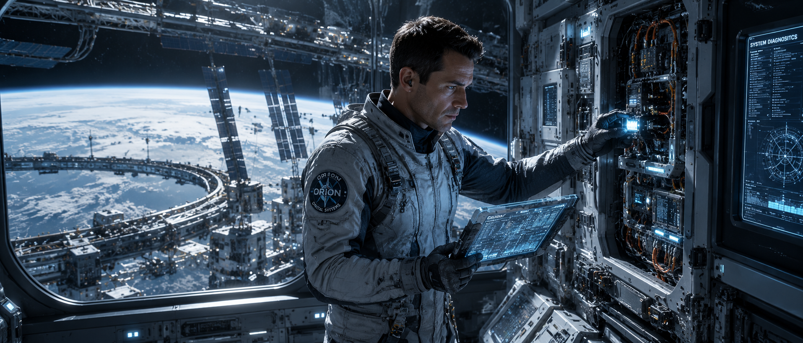

# 🛰️ Space Engineer



## Overview

A highly skilled orbital systems engineer responsible for maintaining humanity's most advanced space habitats. This example demonstrates hard science-fiction design, technical worldbuilding, and futuristic engineering aesthetics.

---

## Input Parameters

```text
CHARACTER_NAME: Orion Vega

CHARACTER_TYPE: Space Engineer

GENDER: Male

AGE_RANGE: 30-40

SPECIES_OR_RACE: Human

ROLE_OR_PROFESSION: Orbital Systems Engineer

PERSONALITY_TRAITS:
intelligent, analytical, innovative, disciplined

ARCHETYPE:
builder

BACKSTORY_THEME:
maintaining humanity's future among the stars

CURRENT_EMOTION:
focused

BODY_TYPE:
fit and athletic

FACIAL_FEATURES:
clean-shaven, calm appearance

EYE_DETAILS:
focused gray eyes

HAIRSTYLE:
short dark hair

SURFACE_DETAILS:
high-tech engineering suit with visible wear

UNIQUE_FEATURES:
orbital station insignia

OUTFIT_OR_ARMOR:
advanced maintenance suit

ACCESSORIES:
holographic engineering tablet

WEAPONS_OR_TOOLS:
precision repair toolkit

TECH_LEVEL:
advanced futuristic

POSE:
standing near observation window

ACTION:
diagnosing critical station systems

EXPRESSION:
professional concentration

ENVIRONMENT:
orbital space station

TIME_OF_DAY:
Earth orbit

ATMOSPHERE:
advanced technological environment

VISUAL_STYLE:
hard science-fiction realism

COLOR_PALETTE:
white, silver, blue

LIGHTING:
artificial station lighting

COMPOSITION:
cinematic engineering scene

CAMERA_ANGLE:
three-quarter view

LENS_TYPE:
35mm lens

DETAIL_LEVEL:
ultra detailed

RENDER_QUALITY:
AAA sci-fi concept art

ASPECT_RATIO:
21:9
```

---

## Generated Output

```text
Orion Vega, orbital systems engineer responsible for maintaining one of humanity's largest space stations, standing beside a panoramic observation window overlooking Earth from orbit. Focused gray eyes studying complex engineering diagnostics displayed across a holographic tablet.

Wearing an advanced maintenance suit featuring modular engineering equipment, illuminated system indicators, reinforced utility components, and realistic signs of continuous operational use. Holding a precision repair toolkit while monitoring critical station infrastructure.

Behind him, enormous space station corridors extend into the distance, filled with advanced machinery, robotic maintenance systems, and glowing control interfaces. Earth shines brilliantly through reinforced observation glass while sunlight reflects across metallic surfaces.

Hard science-fiction realism, ultra-detailed engineering equipment, realistic spacecraft interiors, advanced orbital technology, cinematic composition, blue and silver color palette, realistic lighting, 35mm lens, AAA concept art quality, near-future space infrastructure, masterpiece, 8K.
```

---

## Design Notes

### Why This Works

* Realistic engineering profession
* Strong hard sci-fi identity
* Detailed technological environment
* Believable future technology
* Professional visual storytelling
* Complements explorer archetypes

### Key Design Elements

* Engineering suit
* Holographic diagnostics
* Orbital station
* Earth observation window
* Maintenance equipment

### Genre

Science Fiction • Hard Sci-Fi

### Difficulty

Advanced

### Recommended Models

* Flux
* GPT Image
* Midjourney
* SDXL

### Tags

`space-engineer` `orbital-station` `hard-sci-fi` `engineering` `future-tech` `character-design` `concept-art`
