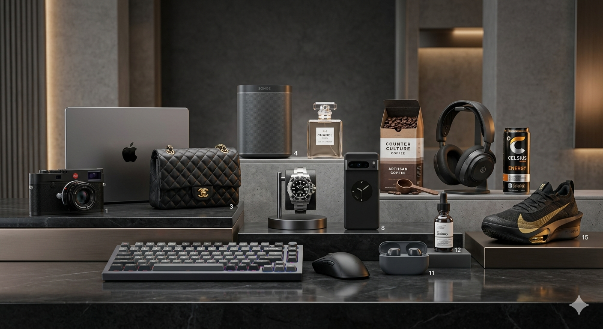
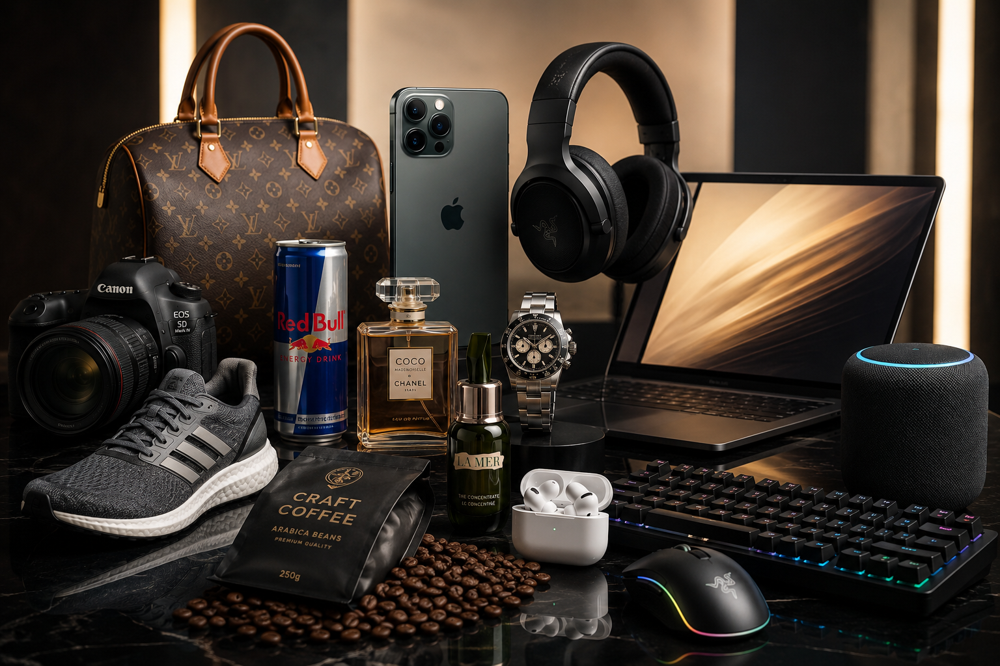

# PRODUCT PHOTOGRAPHY TEMPLATE

> Version: 4.0.0
>
> Category: Product Photography
>
> Compatible With:
> GPT Image • Midjourney • FLUX • SDXL • Ideogram • Leonardo AI • Adobe Firefly

---

Preserve:

* Product shape
* Product proportions
* Product dimensions
* Product materials
* Product textures
* Product colors
* Product branding
* Product logos
* Product labels
* Product construction details

REFERENCE_PRIORITY:

1. Product accuracy from primary reference
2. Materials and textures from primary reference
3. Composition from secondary reference
4. Lighting from secondary reference
5. Creative direction from prompt

DO_NOT_MODIFY:

* Product silhouette
* Product proportions
* Brand identity
* Logo placement
* Product geometry
* Product colors unless specified

---

# PRODUCT INFORMATION

PRODUCT_NAME:

PRODUCT_CATEGORY:

BRAND_NAME:

PRODUCT_SERIES:

PRODUCT_DESCRIPTION:

TARGET_AUDIENCE:

PRICE_POSITIONING:

* Budget
* Mid-range
* Premium
* Luxury
* Ultra Luxury

## KEY_SELLING_POINTS:

*
*
*
*

## UNIQUE_FEATURES:

*
*
*
*

## PRODUCT_MATERIALS:

*
*
*
*

## PRODUCT_FINISH:

*
*
*

## PRIMARY_COLORS:

*
*

## SECONDARY_COLORS:

*
*

## ACCENT_COLORS:

*
*

---

# CREATIVE DIRECTION

PHOTOGRAPHY_STYLE:

* Hero Product Shot
* Luxury Advertising
* Commercial Advertising
* E-Commerce
* Editorial
* Lifestyle
* Flat Lay
* Studio
* Macro
* Campaign
* Product Launch
* Billboard Advertisement

COMMERCIAL_PURPOSE:

* Amazon Listing
* Shopify Store
* Website Hero Banner
* Product Launch
* Social Media Advertisement
* Print Advertisement
* Catalog
* Marketing Campaign

VISUAL_THEME:

BRAND_PERSONALITY:

* Luxury
* Premium
* Futuristic
* Minimalist
* Technical
* Organic
* Wellness
* Performance
* Modern
* Heritage

## MOOD:

*
*

ATMOSPHERE:

EMOTIONAL_RESPONSE:

---

# ENVIRONMENT & SCENE

BACKGROUND_TYPE:

* Pure White
* Pure Black
* Neutral Gray
* Gradient
* Marble
* Concrete
* Stone
* Fabric
* Wood
* Luxury Interior
* Outdoor
* Abstract
* Custom

BACKGROUND_DESCRIPTION:

BACKGROUND_COLORS:

SURFACE_TYPE:

SURFACE_DESCRIPTION:

ENVIRONMENT_STYLE:

SCENE_DESCRIPTION:

## SUPPORTING_ELEMENTS:

*
*
*
*

## PROPS:

*
*
*

ENVIRONMENTAL_EFFECTS:

* Fog
* Mist
* Steam
* Water Splash
* Dust Particles
* Floating Elements
* Smoke
* Rain
* Snow
* None

---

# PRODUCT PLACEMENT

PRODUCT_ORIENTATION:

* Front View
* Three Quarter View
* Side View
* Top View
* Floating
* Tilted
* Exploded View

FRAME_POSITION:

* Center
* Left Third
* Right Third
* Upper Third
* Lower Third

ARRANGEMENT_STYLE:

* Solo Product
* Product Collection
* Product Family
* Product Bundle
* Product Ecosystem

DISPLAY_STYLE:

* Symmetrical
* Minimal
* Dynamic
* Editorial
* Luxury
* Technical

PRODUCT_ELEVATION:

* Surface
* Acrylic Stand
* Marble Plinth
* Floating
* Suspended

NEGATIVE_SPACE_USAGE:

HERO_PRIORITY:

---

# LIGHTING

PRIMARY_LIGHT_SOURCE:

* Softbox
* Octabox
* Strip Light
* Beauty Dish
* Window Light
* Fresnel
* Natural Daylight
* Custom

PRIMARY_LIGHT_POSITION:

SECONDARY_LIGHT_SOURCE:

RIM_LIGHTING:

ACCENT_LIGHTING:

LIGHTING_STYLE:

* High Key
* Low Key
* Medium Contrast
* Soft Diffused
* Cinematic
* Dramatic
* Luxury
* Editorial

LIGHTING_CONTRAST:

SHADOW_STYLE:

* Soft Shadow
* Hard Shadow
* Contact Shadow
* Floating Shadow
* Long Shadow

COLOR_TEMPERATURE:

REFLECTION_CONTROL:

SPECIAL_LIGHTING_NOTES:

---

# CAMERA SETTINGS

CAMERA_BODY:

LENS_TYPE:

FOCAL_LENGTH:

CAMERA_ANGLE:

* Eye Level
* High Angle
* Low Angle
* Overhead
* Three Quarter

CAMERA_DISTANCE:

DEPTH_OF_FIELD:

FOCUS_POINT:

PERSPECTIVE_STYLE:

ASPECT_RATIO:

* 1:1
* 4:5
* 3:2
* 16:9
* 9:16

ORIENTATION:

* Portrait
* Landscape
* Square

---

# COMPOSITION

COMPOSITION_STRATEGY:

* Rule of Thirds
* Golden Ratio
* Symmetrical
* Diagonal
* Layered
* Minimalist
* Editorial

VISUAL_FLOW:

FOCAL_HIERARCHY:

BALANCE_STYLE:

COPY_SPACE:

LOGO_SPACE:

CTA_SPACE:

---

# MATERIAL RENDERING

GLASS_RENDERING:

METAL_RENDERING:

PLASTIC_RENDERING:

FABRIC_RENDERING:

LEATHER_RENDERING:

WOOD_RENDERING:

CERAMIC_RENDERING:

LIQUID_RENDERING:

SPECIAL_MATERIAL_INSTRUCTIONS:

---

# COLOR & BRANDING

PRIMARY_COLOR_PALETTE:

SECONDARY_COLOR_PALETTE:

ACCENT_COLORS:

COLOR_HARMONY:

COLOR_PSYCHOLOGY:

BRAND_COLOR_RULES:

POST_PROCESSING_STYLE:

* Natural
* Luxury
* Cinematic
* Editorial
* Commercial
* Vibrant
* Desaturated

COLOR_GRADING:

---

# QUALITY STANDARDS

QUALITY_LEVEL:

* Commercial
* Premium Commercial
* Luxury Commercial
* Agency Grade
* Global Campaign Grade

DETAIL_LEVEL:

* Detailed
* Ultra Detailed
* Hyper Detailed

RENDERING_STYLE:

* Photorealistic
* CGI Realism
* Luxury Advertising
* Editorial Realism

COMMERCIAL_STANDARD:

* Advertising agency quality
* Professional studio photography
* Premium commercial execution
* Accurate reflections
* Realistic materials
* Realistic shadows
* Accurate colors
* Brand consistency
* Commercial retouching quality

OUTPUT_QUALITY:

* Ultra realistic
* Hyper detailed
* Sharp focus
* HDR
* Premium branding
* Commercial quality
* Advertising campaign quality
* 8K

---

# VIDEO EXTENSION (OPTIONAL)

VIDEO_TYPE:

VIDEO_DURATION:

CAMERA_MOVEMENT:

* Orbit
* Push In
* Pull Out
* Dolly
* Crane
* Tracking
* Product Spin

PRODUCT_MOVEMENT:

SPECIAL_EFFECTS:

TARGET_PLATFORM:

* TikTok
* Instagram Reels
* YouTube Shorts
* Website Hero
* Advertisement

---

# PLATFORM SETTINGS

MIDJOURNEY_PARAMETERS:

FLUX_PARAMETERS:

GPT_IMAGE_PARAMETERS:

SDXL_PARAMETERS:

LEONARDO_PARAMETERS:

IDEOGRAM_PARAMETERS:

---

# NEGATIVE PROMPT

NEGATIVE_PROMPT:

no low quality

no blurry details

no out of focus objects

no pixelation

no distortion

no warped geometry

no incorrect proportions

no incorrect materials

no poor reflections

no bad lighting

no unrealistic shadows

no color shifting

no oversaturation

no undersaturation

no duplicate objects

no floating artifacts

no AI artifacts

no rendering errors

no watermark

no text overlay

no missing product parts

no cluttered composition

no amateur photography

---

# FINAL MASTER PROMPT

Commercial product photography featuring [PRODUCT_NAME], using [PRIMARY_REFERENCE_IMAGE] as the primary product reference and [SECONDARY_REFERENCE_IMAGE] as the secondary style reference.

Preserve the exact product shape, proportions, materials, colors, textures, branding, logo placement, and visual identity from the reference PNG images.

Hero subject: [PRODUCT_DESCRIPTION].

Photography style: [PHOTOGRAPHY_STYLE].

Commercial purpose: [COMMERCIAL_PURPOSE].

Visual theme: [VISUAL_THEME].

Brand personality: [BRAND_PERSONALITY].

Mood: [MOOD].

Atmosphere: [ATMOSPHERE].

Environment: [SCENE_DESCRIPTION].

Surface: [SURFACE_TYPE].

Lighting: [PRIMARY_LIGHT_SOURCE], [LIGHTING_STYLE], [COLOR_TEMPERATURE].

Camera: [LENS_TYPE], [FOCAL_LENGTH], [CAMERA_ANGLE].

Composition: [COMPOSITION_STRATEGY].

Materials rendered with physically accurate behavior, realistic reflections, realistic shadows, realistic refractions, premium textures, studio-grade lighting, commercial retouching quality, luxury advertising aesthetics, photorealistic rendering, ultra-detailed surfaces, premium branding, masterpiece quality, advertising agency quality, award-winning commercial photography, sharp focus, HDR, 8K.

