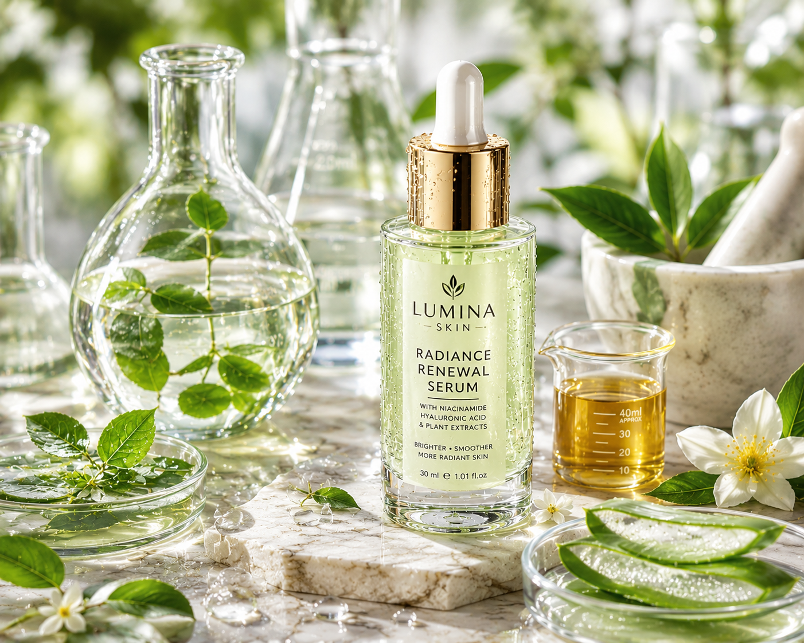
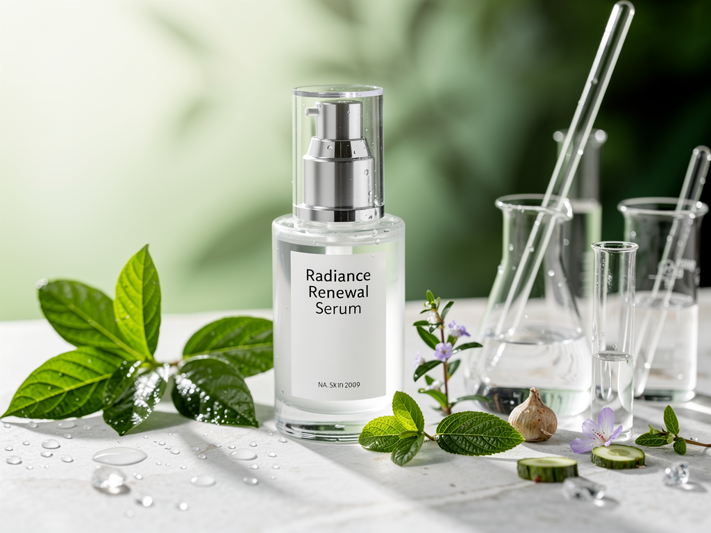
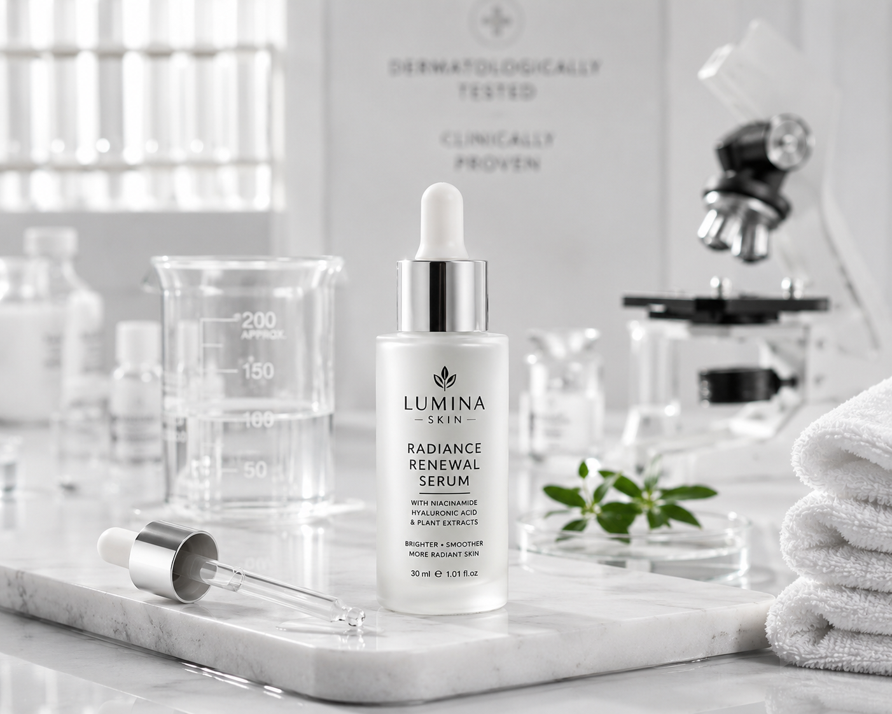
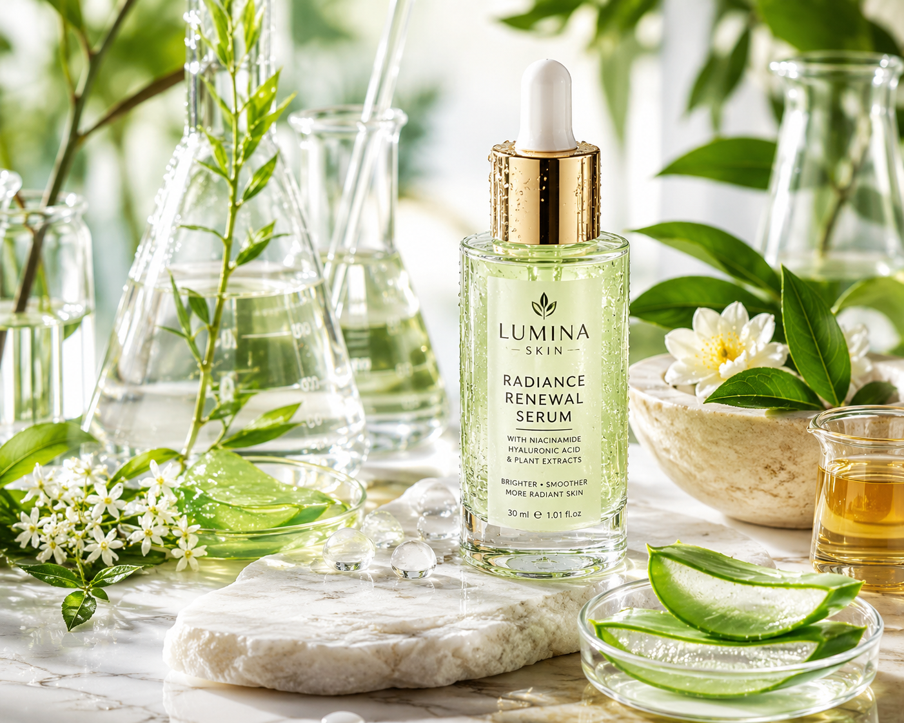
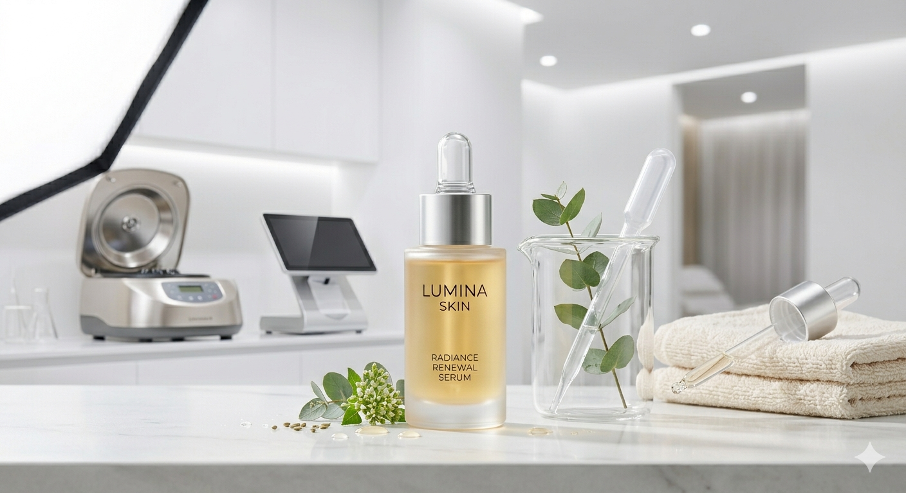

# Skincare Serum Photography Collection

**Premium commercial skincare photography campaign featuring a luxury serum brand across five professionally art-directed scenes.**

<br/>

<div align="center">



<br/>

[**Overview**](#overview) · [**Gallery**](#gallery) · [**Prompts**](#prompts)

</div>

---

# Overview

This collection demonstrates a complete luxury skincare advertising campaign built around a single premium serum product.

The campaign maintains:

* Consistent branding
* Consistent product design
* Consistent materials
* Consistent label placement
* Consistent luxury aesthetic

while exploring different commercial photography styles commonly used by global skincare brands.

---

# Gallery

<table>
<tr>
<td align="center">


### Hero Product

</td>

<td align="center">



### Clinical Laboratory

</td>
</tr>

<tr>
<td align="center">



### Ingredient Story

</td>

<td align="center">



### Botanical Luxury

</td>
</tr>

<tr>
<td align="center" colspan="2">



### Lifestyle Interior

</td>
</tr>
</table>

---

# Prompts

---

## Image 01 — Hero Product Shot

**Reference Image**

`../assets/lumina1.png`

### Prompt

```text
Commercial product photography featuring Lumina Skin Radiance Renewal Serum, elegant frosted glass serum bottle with premium silver dropper cap, standing upright on polished white marble surface, soft white gradient background, luxury clinical skincare branding, premium cosmetic advertising campaign, clean beauty aesthetic, centered composition, large softbox beauty lighting, realistic glass refraction, accurate reflections, professional commercial retouching, luxury skincare marketing visuals, photorealistic, ultra detailed, sharp focus, agency-grade product photography, HDR, masterpiece, 8K.
```

---

## Image 02 — Clinical Laboratory Shot

**Reference Image**

`../assets/lumina2.png`

### Prompt

```text
Clinical luxury skincare photography featuring Lumina Skin Radiance Renewal Serum inside a modern dermatology laboratory environment, premium frosted glass bottle with silver dropper cap, glass beakers, laboratory tools, scientific skincare atmosphere, clean white environment, professional cosmetic advertising campaign, bright clinical lighting, realistic laboratory materials, luxury beauty branding, trustworthy scientific aesthetic, premium skincare marketing photography, photorealistic, ultra detailed, sharp focus, commercial campaign quality, HDR, 8K.
```

---

## Image 03 — Ingredient Story Shot

**Reference Image**

`../assets/lumina3.png`

### Prompt

```text
Premium skincare ingredient photography featuring Lumina Skin Radiance Renewal Serum surrounded by fresh botanical ingredients, green leaves, water droplets, scientific glass vessels, luxury wellness aesthetic, nature meets science visual storytelling, clean beauty branding, bright natural daylight, realistic botanical textures, luxury cosmetic campaign, premium skincare advertising photography, photorealistic, ultra detailed, realistic materials, sharp focus, agency-grade quality, HDR, 8K.
```

---

## Image 04 — Botanical Luxury Shot

**Reference Image**

`../assets/lumina4.png`

### Prompt

```text
Luxury botanical skincare photography featuring Lumina Skin Radiance Renewal Serum among lush green botanicals, elegant natural sunlight, premium wellness environment, sophisticated beauty campaign, luxury skincare branding, realistic leaves, fresh organic atmosphere, premium cosmetic marketing visuals, luxury advertising photography, natural beauty aesthetic, photorealistic rendering, ultra detailed textures, sharp focus, commercial campaign quality, HDR, masterpiece, 8K.
```

---

## Image 05 — Lifestyle Interior Shot

**Reference Image**

`../assets/lumina5.png`

### Prompt

```text
Luxury lifestyle skincare photography featuring Lumina Skin Radiance Renewal Serum displayed inside a premium modern beauty interior, elegant home-spa atmosphere, contemporary luxury design, soft natural daylight, sophisticated wellness branding, premium cosmetic advertising campaign, realistic materials, clean architectural environment, luxury skincare marketing visuals, photorealistic rendering, ultra detailed, professional commercial photography, agency-grade quality, sharp focus, HDR, masterpiece, 8K.
```

---

# Negative Prompt

```text
no low quality, no blurry details, no out of focus objects, no pixelation, no distortion, no warped geometry, no incorrect proportions, no incorrect materials, no poor reflections, no bad lighting, no unrealistic shadows, no color shifting, no oversaturation, no undersaturation, no duplicate objects, no floating artifacts, no AI artifacts, no rendering errors, no watermark, no text overlay, no missing product parts, no cluttered composition, no amateur photography
```

---

# Quality Standard

**Tier:** Agency Grade

Applied quality signals:

* Professional studio photography
* Premium commercial execution
* Luxury skincare branding
* Realistic reflections
* Accurate materials
* Commercial retouching
* Photorealistic rendering
* Ultra-detailed textures
* Sharp focus
* HDR
* 8K quality
